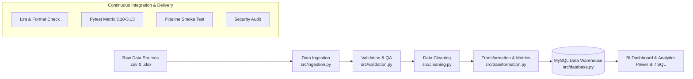

# Automated Sales Data Pipeline

[](https://github.com/soham-analyst/Automation-Sales-Pipeline/actions/workflows/ci.yml)
[](https://www.python.org/)
[](https://github.com/psf/black)
[](https://github.com/astral-sh/ruff)
[](LICENSE)

An end-to-end automated data engineering pipeline designed to ingest, validate, clean, transform, and load multi-format sales data (CSV/Excel) into a relational Data Warehouse with reporting integration.

---

## Architecture Overview



---

## Project Structure

```
sales-data-pipeline/
├── .github/
│   └── workflows/
│       ├── ci.yml                 # Multi-stage CI pipeline (lint, test, smoke, security)
│       └── release.yml            # Automated CD release pipeline
├── config/
│   ├── __init__.py
│   └── config.py                  # Dynamic configuration & path loader
├── data/
│   ├── raw/                       # Source sales files (.csv, .xlsx)
│   ├── processed/                 # Cleaned & transformed datasets
│   ├── archive/                   # Successfully processed file archives
│   └── rejected/                  # Records failing validation
├── docs/
│   └── data_dictionary.md         # Field definitions and data quality specs
├── logs/                          # Pipeline execution and error logs
├── scripts/
│   ├── generate_sample_data.py    # Synthetic dataset generator with data quality anomalies
│   └── push_to_github.ps1         # Automated helper script to push project to GitHub
├── sql/
│   ├── create_tables.sql          # DDL schemas for fact & dimension tables
│   ├── analysis_queries.sql       # Business analytics queries
│   └── validation_queries.sql     # Data reconciliation checks
├── src/                           # Core ETL modules
│   ├── __init__.py
│   ├── ingestion.py
│   ├── validation.py
│   ├── cleaning.py
│   ├── transformation.py
│   ├── database.py
│   └── pipeline.py
├── tests/                         # Test suite
│   ├── __init__.py
│   ├── test_smoke.py              # Repository & configuration sanity tests
│   └── test_data_generator.py     # Dataset integrity tests
├── .env.example                   # Environment configuration template
├── .gitignore                     # Git ignore rules for data pipelines
├── main.py                        # Pipeline entrypoint
├── pyproject.toml                 # Tool configurations (pytest, ruff, black)
├── requirements.txt               # Production dependencies
├── requirements-dev.txt           # Development & testing dependencies
└── README.md
```

---

## Quickstart & Setup

### 1. Clone & Set Up Environment

```bash
# Clone the repository
git clone https://github.com/soham-analyst/Automation-Sales-Pipeline.git
cd sales-data-pipeline

# Create virtual environment
python -m venv .venv

# Activate virtual environment
# On Windows (PowerShell):
.venv\Scripts\Activate.ps1
# On Linux/macOS:
source .venv/bin/activate

# Install dependencies
pip install -r requirements.txt
pip install -r requirements-dev.txt
```

### 2. Configure Environment

Copy the `.env.example` file to `.env` and fill in your database credentials:

```bash
cp .env.example .env
```

### 3. Generate Sample Data

To regenerate synthetic sales data with realistic business edge-cases:

```bash
python scripts/generate_sample_data.py
```

### 4. Run Tests

```bash
# Run tests with pytest and coverage report
pytest --cov=src --cov=config --cov-report=term-missing

# Or run with standard library unittest
python -m unittest discover -s tests
```

---

## CI/CD Pipeline

The GitHub Actions workflow (`.github/workflows/ci.yml`) runs automatically on every `push` and `pull_request` across branches `main`, `master`, and `develop`:

1. **Code Quality**: Lints with `ruff` and checks formatting with `black`.
2. **Test Matrix**: Executes the test suite against Python `3.10`, `3.11`, `3.12`, and `3.13`.
3. **Pipeline Smoke Test**: Executes synthetic data generation and verifies output datasets.
4. **Security Audit**: Scans dependencies with `pip-audit` for known vulnerabilities.
5. **Continuous Delivery**: Automatically packages artifacts and creates a GitHub Release when version tags (`v*.*.*`) are pushed.
